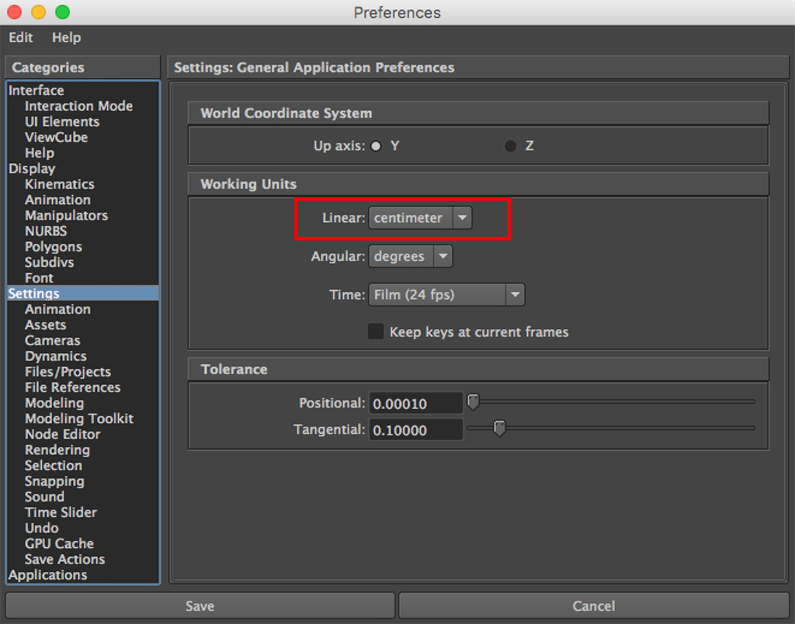
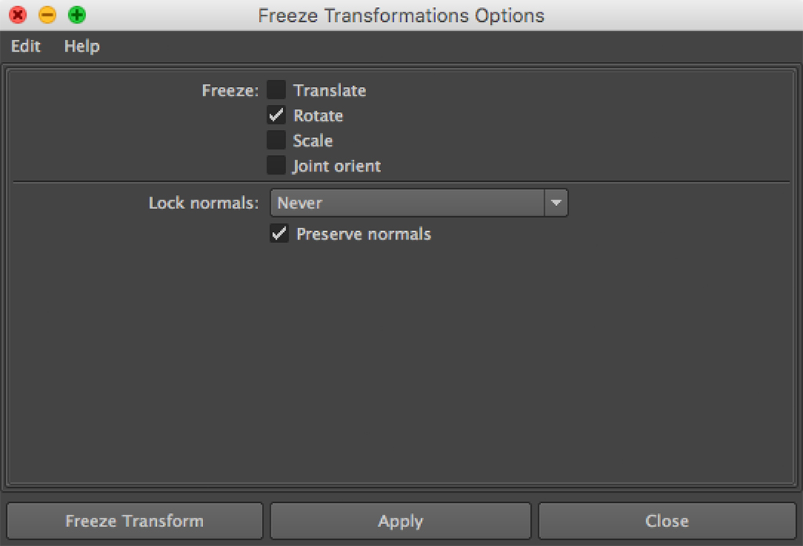
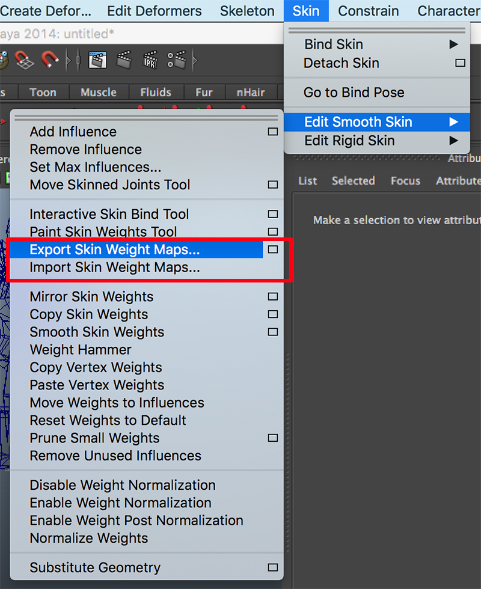
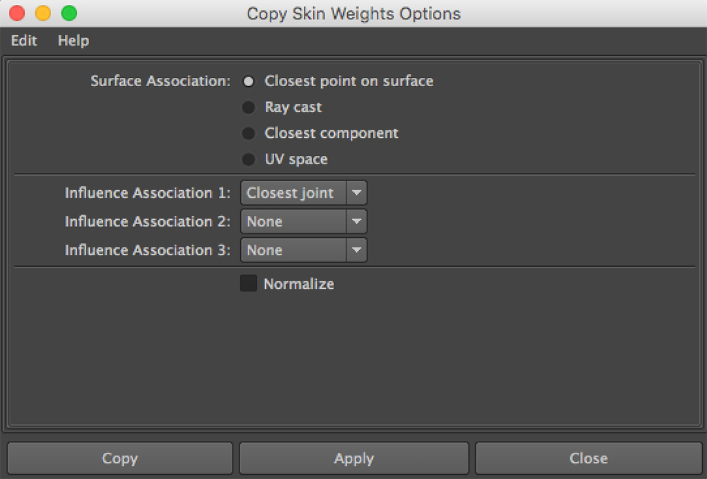

# 统一模型的轴向和缩放

**2018-9-22**

在开发中我们希望能够统一模型的轴向和缩放，以达到制作标准的一致。按照 Unity 的建议：首先是长度单位，一个长度单位对应一米；其次是模型的轴线和缩放，Z轴正方向面向前，Y轴正方向向上，X轴正方向向右。

对于静态模型，这些修改都是比较简单的，长度单位可以设置下 Maya（我使用 Maya 作为工具，所以下文提到的有都是 Maya） 的单位配置，将模型的轴向和缩放设置到合适的值，然后 Freeze Transformations 即可。Freeze Transformations 这个命令的功能是将当前模型的 Transform 认为是归零的状态，相当于进行了一次反向的 Transform 操作，并将 Transform 归零。

而对于蒙皮网格，并没有这么简单。无法直接移动和缩放网格，因为网格已经被蒙皮锁定了。同样，骨骼也不能直接移动和缩放。

所以第一步就需要解除蒙皮的锁定，使用 Detach Skin 命令。Detach Skin 命令有三个可选参数，分别是：Delete Histroy 删除所有蒙皮和 Deformation 信息，模型回到蒙皮前的 T-Pose 状态，当想要一个全新的蒙皮时使用这个选项；Keep Histroy，保持所有信息，以便稍后恢复，模型回到 T-Pose 状态，当需要添加新骨骼时使用这个选项；Bake Histroy，删除所有信息，但是模型保持骨骼动作不回到 T-Pose 状态，一般做一些静帧渲染时使用。我认为理所应当选择 Keep Histroy，这样才能在修改模型之后恢复蒙皮信息，而不用重新刷一遍。但是经过测试后证实行不通，模型被修改后再次使用旧的蒙皮信息绑定骨骼会导致渲染上的错误，从原理上说就是，模型被缩放旋转之后，其相对于骨骼的 bind-pose 发生了变化，而 Keep Histroy 还是使用了旧的 bind-pose，所以就有问题了。如果只是对某个顶点进行位移是不会有问题的，而我这里是对整个模型的旋转和缩放。于是只能选择 Delete Histroy 或者 Bake Histroy，随之而来的问题是蒙皮数据的丢失，只能重新手工刷一遍蒙皮，这是无法接受的，需要找到一种方法将蒙皮信息保存下载，修改完模型后使用保存的数据进行恢复。

Export Skin Weight Maps 可以将蒙皮数据导出为纹理，一个骨骼对应一张纹理，Import Skin Weight Maps 将纹理恢复成蒙皮数据。这个方法看似不错，经过多次尝试后，重新绑定骨骼播放动画，有些地方的蒙皮还是出现了穿插，并没有达到原始动画的效果。起初觉得是导出纹理的尺寸太小，无法容纳大量的顶点，于是就增加纹理的尺寸，效果依然不好。最后明白了，Export Skin Weight Maps 是根据 UV 来保存的，如果模型的 UV 分布的不好，比如有重叠，效果往往是不理想的。所以这种方法就只能放弃了，所有模型重新展 UV 是不现实的，UV 的重叠也节省了贴图尺寸，再继续找新的方法。

Copy Skin Weights 可以将一个模型的蒙皮复制到另一个模型上，前提是两个模型的顶点坐标在世界坐标系下尽量重合。我的方法是，先将原始模型原位复制一份一旁备用，解绑原始模型骨骼（丢弃旧的蒙皮数据），修改原始模型，重新自动蒙皮，最后将复制出来的模型蒙皮复制回原始模型。至此模型的轴向和缩放问题就得到了解决，达到了最初的要求。这里有一点需要注意，解绑模型骨骼时可以有两个选择，Delete Histroy 或者 Bake Histroy，对于模型的 T-Pose 和骨骼的 T-Pose 一致的情况，任选其一都是可以的，如果不一致需要选择 Bake Histroy, 否则会由于顶点坐标没有尽量重合而复制蒙皮失败。