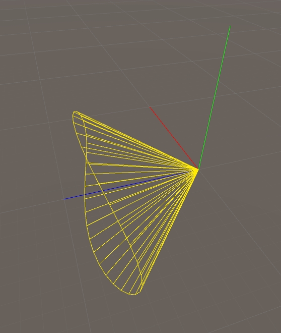

# 绘制圆锥体工具

**2017-9-11**
	
> 

可以在 SceneView 中绘制圆锥体线框，在做编辑器工具的时候要用到，找了下 Unity 居然没有这个功能。直接抄的 UE4 的实现，修改的地方主要涉及到坐标空间差异。

[完整代码@github](https://github.com/chengkehan/unityLab/blob/master/DrawDebugConeGizmos.cs)