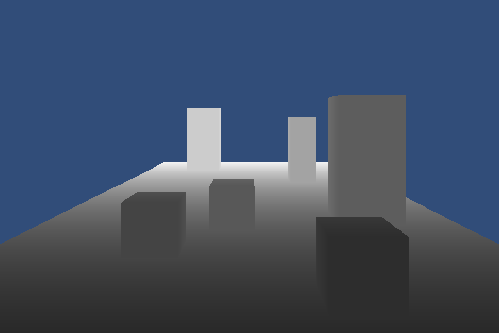
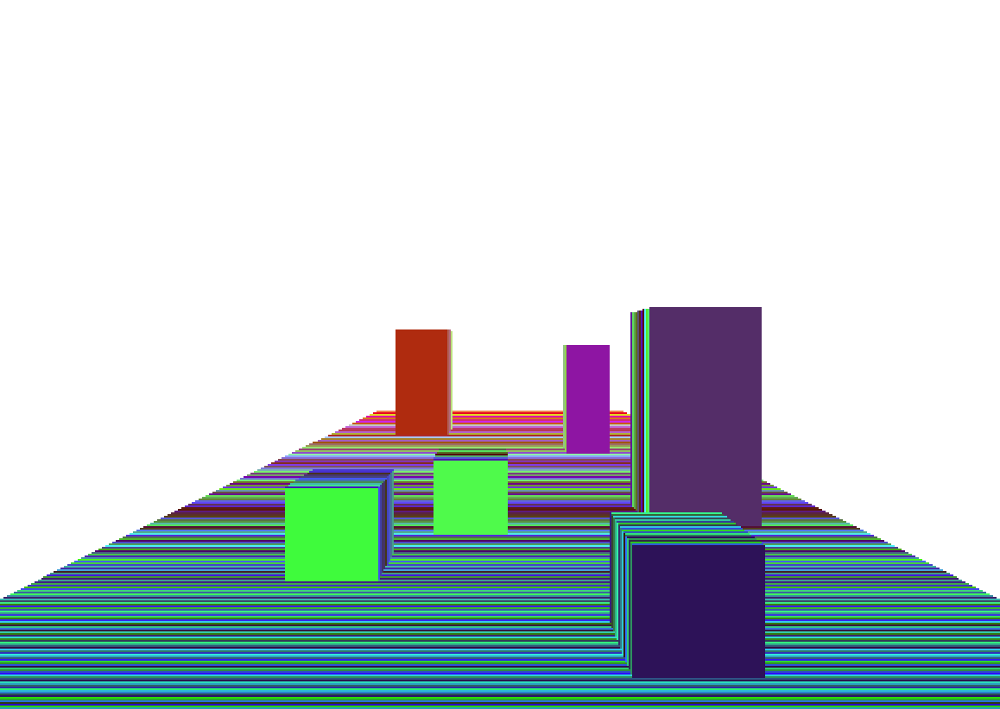

#定制自己的 Depth Texture

**2016-3-5**

深度纹理（Depth Texture）就是一张包含了被相机渲染物体的深度信息的纹理。在 Unity 中，有一种简便的方法来开启深度纹理。

    // 设置相机
    camera.depthTextureMode = DepthTextureMode.Depth;
    // 在 Shader 中获取
    _CameraDepthTexture
    
需要注意的是深度纹理和深度缓存并不是同一个东西，虽然它们的数据是相似的。在 Unity4 中，深度纹理是用过 Shader Replacement 来实现的，而Unity5 中，是在 ShadowCaster Pass 中生成。具体的信息可以看[这篇文章](http://m.blog.csdn.net/article/details?id=50559732)，里面讲述的很详细。

所以，使用深度纹理是需要一定代价的，就是需要先把场景绘制一遍（Unity4），或者多一遍实时阴影的消耗（Unity5）。当然，如果是使用延时渲染，那么深度纹理可以认为是零消耗，因为 G-Buffer 本身就包含了 Depth Texture 的信息。

为什么要定制自己的 Depth Texture 呢？主要有以下几个原因。

* 场景中很多小物件，我并不希望它们被绘制到 Depth Texture，因为并不影响整体的效果，不绘制可以减小消耗。
* 可以自己对深度纹理进行一些处理（后处理效果、离线的预处理等等）
* 可控性更高

下面是关键的 Shader 代码，其实还是很简单的，自己用 Camera 的 Shader Replacement 来渲染。

    // vertex:
    o.depth = o.pos.z;
    
    // fragment:
    float n = _ProjectionParams.y;
    float f = _ProjectionParams.z;
    float c = (i.depth - n) / f;
    return c;
    
下面是渲染的效果

有一点需要注意的是，如果相机的近平面和远平面相距太远，直接将深度值输出到单通道会造成精度的丢失。Unity 提供了一种技巧可以将 float 存储到 RGBA 四个通道中。当然在对精度要求不是很高的情况下，可以忽略，减少计算量。

    inline float4 EncodeFloatRGBA( float v )
    inline float DecodeFloatRGBA( float4 enc )
    
