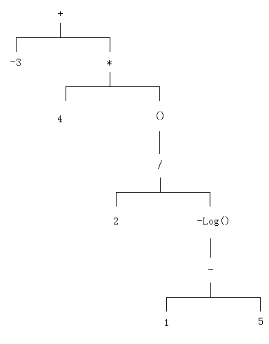

# 动态配置文件

**2020-12-6**

游戏中使用的配置文件是在 Excel 编辑出来的表格数据，然后导出游戏逻辑可用的轻量级文件格式，多为csv、xml、luatable等。使用 Excel 编辑配置文件的好处是方便、灵活，可以拉去数据，合并数据，并使用公式计算，引用单元格。所以我们认为数据在 Excel 中时，都是动态的。但是当到导出为游戏逻辑读取的文件后，数据就变成了静态。静态的缺点是需要在代码中根据需求重组并计算数据，那么这个重组并计算的逻辑就是写死在代码了。当有出现大量的这种情况时，如果想要通过不断的调整来验证想法时，就会变得很困难。同理，当客户端和服务端在读取在解析同一个字段时，就会导致两份相同逻辑的代码，大大增加维护时的出错率以及调试成本。

为了让这些静态数据依然保留部分的动态性，在读取静态表中的某个字段的值时，引入了公式和引用字段的功能。

先说说公式。比如说当表中某个字段的值为 "伤害减免{pow(api.myRoleExp*2+3,0.5)}%”。当读取这个字段的时候，并不是直接把这个字符串读取出来，而是读取到的值就已经是经过公式计算出的结果。在大括号内的就是公式。所以就需要实现公式解析计算，并引入变量的概念。公式的解析计算使用的是表达式树的方法，大多数语言都有现成的库可以套用，如果是动态解析类的语言，做起来应该会更方便。

而公式中的变量，其实就是代码中导出的属性接口。比如上面这个公式中的 “myRoleExp”，在代码中就会导出一个同名的属性接口。这样就完成了公式的解析。

对于引用字段的功能，我们希望达到这样的效果。比如装备的某个字段的值为 “闪避率增加{pow((self.quality+self.agility+api.myRoleExp+api.myPetExp)*30,0.5)}%”。可以看到这是一个较复杂的公式，在前面的基础上，变量不但表示代码中导出的属性接口，还可以表示表中的另一个字段。例如 self.quality 表示当前行的 quality 字段。

如果再需要扩展，可以考虑下怎么做跨表读取字段的操作。再有就是复杂的条件查找操作看看能不能封装成api函数导出，就像数学函数 pow 一样直接调用即可。