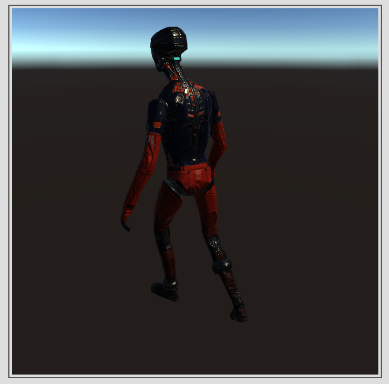
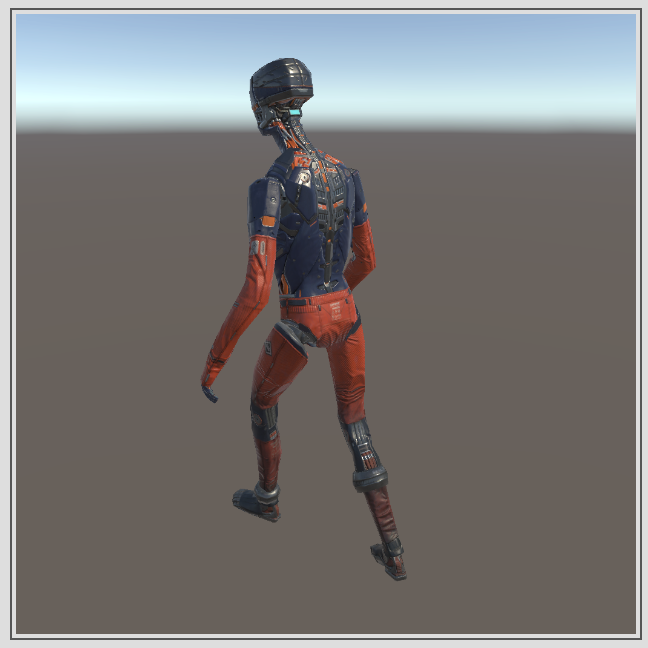

# Editor GUI 的 Gamma Correction

**2017-4-5**

Unity 在绘制 Editor GUI 的时候需要注意 Gamma Correction。我使用一个 Camera 将场景绘制到 RenderTexture 上，然后使用 GUI.DrawTexture （使用 Unity 其它的 Editor GUI 方法也一样）绘制这个 RenderTexture，会得到这样的结果：

> 
> 
> 左图是错误绘制的。而实际想要的为右图的正确结果。

从上图可以看出，渲染效果明显不对，暗了很多，这其实就是 Gamma Correction 导致的。需要注意的是 Player Setting 中的 Color Space，使用的是 Linear 而非 Gamma，RenderTexture 使用的是 sRGB 而非 Linear。究其原因是 Editor GUI 在采样纹理时，由于纹理是 sRGB 的，所以会转换到 Linear 空间，而在传给显示器时并没有再将其转换到非线性空间，导致显示器直接将 2.2 的 gamma 应用到了 Linear 的值上，使得整个画面变暗了。

所以为了解决这个问题，就需要自己来做 Gamma Correction。我的方法是将一张 sRGB 的 RenderTexture Blit 到一张 Linear 的 RenderTexture 上，对输出的值进行 1/2.2 的 gamma 矫正。这样就正好和显示器的 2.2 的 gamma 抵消，显示出正确的效果。关键代码如下：

	// App Code
	rt = new RenderTexture(1024, 1024, 32, RenderTextureFormat.Default, RenderTextureReadWrite.Default);
	rtSRGB = new RenderTexture(1024, 1024, 0, RenderTextureFormat.Default, RenderTextureReadWrite.Linear);
	
	Graphics.Blit(rt, rtSRGB, gammaCorrectionMtrl);
	
	GUILayout.Box(rtSRGB, GUILayout.Width(width), GUILayout.Height(height));
	
	// Shader of gammaCorrectionMtrl
	fixed4 frag (v2f i) : SV_Target
	{
		fixed4 col = tex2D(_MainTex, i.uv);
		col.rgb = pow(col.rgb, 1 / 2.2);
		col.a = 1;
		return col;
	}
	
Unity 还为我们提供了一个 API 叫做 [GL.sRGBWrite](https://docs.unity3d.com/ScriptReference/GL-sRGBWrite.html), 可以在绘制 Editor GUI 前将其设置为 true，绘制结束后复位，这样就不用考虑以上的问题了，这是因为 Unity 会将 Editor GUI 进行 1/2.2 的 gamma 矫正。类似下面的代码：

	GL.sRGBWrite = true;
	
	GUI.DrawTexture(...);
	
	// DrawBox 默认会自带一个灰色的边框，由于 gamma 矫正，这个灰色的边框变得更偏向白色了
	GUILayout.Box(...);
	
	GL.sRGBWrite = false;
	
	