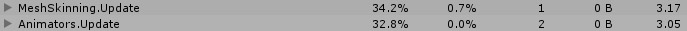
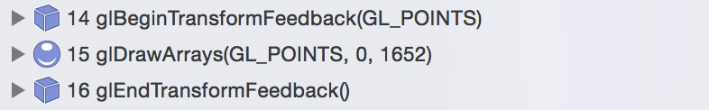
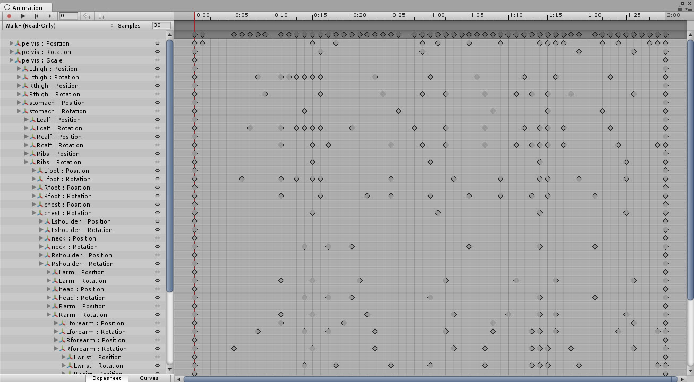
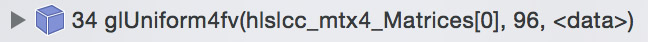
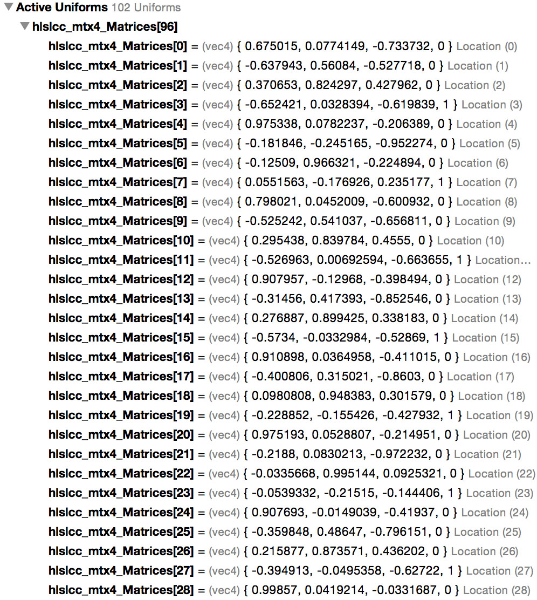
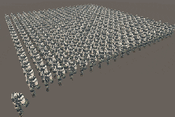

# GPU Skinning

**2016-11-27**

>  
>  
>
> 使用了 ShadowGun 中的角色模型

当场景中有很多人物动画模型的时候会产生大量开销，这些开销除了 DrawCall 外，很大一部分来自于骨骼动画。Unity 内置提供了 GPU Skinning 的功能，但我测试下来并没有对整体性能有任何提升，反而整体的开销增加了不少。有很多种方法来减小骨骼动画的开销，每一种方法都有其利弊，都不是万金油，这里介绍的方法同样如此。其实本质还是 GPU Skinning，由我们自己来实现，但是和 Unity 内置的 GPU Skinning 有所区别。

> 
> 
> 开启 Unity 内置的 GPU Skinning

从上图中可以看到，Unity 调用到了 Opengl ES 的 Transform Feedback 接口，这个接口至少要到 OpenGL ES 3.0 才有。<del>我理解的 Transform Feedback，就是将大批的数据传递给 Vertex Shader，将 GPU 计算过后的结果通过一个 Buffer Object 返回到 CPU 中，CPU 再从 Buffer Object 读取数据（或直接将 Buffer Object 传递给下一步）在随后步骤中使用。显然，在骨骼动画中，Transform Feedback 负责骨骼变换，Unity 将变换后的结果拿来再进行 GPU 蒙皮操作。</del>

---

_**2017-4-6:上面删除的那句话为我的理解错误，感谢知乎上[燃野](https://www.zhihu.com/people/yesbaba/answers)和[peter liu](https://www.zhihu.com/people/peter-liu-80-97/answers)的指正，详见[这篇文章](https://zhuanlan.zhihu.com/p/26200956?group_id=833288008760451072)后的评论。GLES3-Transform Feedback，DirectX 11-StreamOut。为此我又去仔细看了下细节，在开启 GPUSkinning 的时候，Unity 确实已经在 CPU 中进行了骨骼变换，而后将矩阵数组传递给 Shader，通过 Transform Feedback 后，将结果存储到 Buffer Object 中，这时 Buffer Object 中存储的顶点数据已经是蒙皮完成了，最后渲染模型的时候直接拿来用即可。下面这段 glsl 既是输出 Transform Feedback 的，也证明了这点。**_

	#version 300 es

	const int max_bone_count = 32;
	const highp float max_bone_count_inv = 1.0 / float(max_bone_count); 
	const highp float half_texel = 0.5 * max_bone_count_inv; 
	in vec3 in_vertex;
	in vec3 in_normal;
	in vec4 in_tangent;
	in ivec2 in_boneIndices;
	in vec2  in_boneWeights;
	out vec3 out_pos;
	out vec3 out_normal;
	out vec4 out_tangent;

	uniform vec4 bones[max_bone_count*3];
	#define GET_MATRIX(idx) mat4( bones[int(idx)*3 + 0], bones[int(idx)*3 + 1], bones[int(idx)*3 + 2], vec4(0.0, 0.0, 0.0, 1.0))

	void main(void)
	{
		vec4 inpos = vec4(in_vertex.xyz, 1.0);
		mat4 localToWorldMatrix = GET_MATRIX(in_boneIndices.x) * in_boneWeights[0];
		if(in_boneWeights[1] > 0.0)
			localToWorldMatrix += GET_MATRIX(in_boneIndices.y) * in_boneWeights[1] ;
	 	out_pos = (inpos * localToWorldMatrix).xyz;
		gl_Position = vec4(out_pos.xyz, 1.0);
		out_normal = normalize( ( vec4(in_normal.xyz, 0.0) * localToWorldMatrix)).xyz;
		out_tangent = vec4( normalize( ( vec4(in_tangent.xyz, 0.0) * localToWorldMatrix)).xyz, in_tangent.w);
	}

---

这次我们要动手实现的就是这个过程，但是不使用 Transform Feedback，因为要保证在 OpenGL ES 2.0 上也能良好运行，况且引擎也没有提供这么底层的接口。

大致的步骤是这样的：

* 将骨骼动画数据序列化到自定义的数据结构中。这么做是因为这样能完全摆脱 Animation 的束缚，并且可以做到 Optimize Game Objects（Unity 中一个功能，将骨骼的层级结构 GameObjects 完全去掉，减少开销），同时不丢失绑点。
* 在 CPU 中进行骨骼变换。
* 将骨骼变换的结果传递给 GPU，进行蒙皮。

很简单的三大步，对于传统的骨骼动画来说没有任何特殊的步骤，下面我会对其中的每一步展开说明，并将其中的细节说清楚。

### 提取骨骼动画数据

> 
>
> Unity 中的 Animation 数据

目的就是将这些数据提取出来，存储到自定义的数据结构中。代码大致是这样的：

	EditorCurveBinding[] curvesBinding = AnimationUtility.GetCurveBindings(animClip);
	foreach(var curveBinding in curvesBinding)
	{
		// 旋转
		AnimationCurve curveRX = AnimationUtility.GetEditorCurve(animClip, curveBinding.path, curveBinding.type, "m_LocalRotation.x");
		AnimationCurve curveRY = AnimationUtility.GetEditorCurve(animClip, curveBinding.path, curveBinding.type, "m_LocalRotation.y");
		AnimationCurve curveRZ = AnimationUtility.GetEditorCurve(animClip, curveBinding.path, curveBinding.type, "m_LocalRotation.z");
		AnimationCurve curveRW = AnimationUtility.GetEditorCurve(animClip, curveBinding.path, curveBinding.type, "m_LocalRotation.w");
		
		// 位移
		AnimationCurve curvePX = AnimationUtility.GetEditorCurve(animClip, curveBinding.path, curveBinding.type, "m_LocalPosition.x");
		AnimationCurve curvePY = AnimationUtility.GetEditorCurve(animClip, curveBinding.path, curveBinding.type, "m_LocalPosition.y");
		AnimationCurve curvePZ = AnimationUtility.GetEditorCurve(animClip, curveBinding.path, curveBinding.type, "m_LocalPosition.z");
		
		// 不考虑缩放，假定所有骨骼的缩放都是 1
		
		float curveRX_v = curveRX.Evaluate(second);
		float curveRY_v = curveRY.Evaluate(second);
		float curveRZ_v = curveRZ.Evaluate(second);
		float curveRW_v = curveRW.Evaluate(second);
		
		float curvePX_v = curvePX.Evaluate(second);
		float curvePY_v = curvePY.Evaluate(second);
		float curvePZ_v = curvePZ.Evaluate(second);
		
		Vector3 translation = new Vector3(curvePX_v, curvePY_v, curvePZ_v);
		Quaternion rotation = new Quaternion(curveRX_v, curveRY_v, curveRZ_v, curveRW_v);
		NormalizeQuaternion(ref rotation);
		matrices.Add(
			Matrix4x4.TRS(translation, rotation, Vector3.one)
		);
	}
	
其中有两个注意点。第一，要清楚 AnimationCurve 中提取出来的旋转量是欧拉角还是四元数，这里我一开始就弄错了，想当然认为是欧拉角，所以随后计算得到的结果也就错了。第二，用来旋转的四元数，必须是单位四元数（模是1），否则你会得到 Unity 的一个报错信息。

以上的代码中，我将每一帧的数据以 30fps 的频率直接采样了出来，其实也可以不采样出来，而是等需要的时候再从 AnimationCurve 中采样，这样会更平滑但是运行时的计算量也更多了。

### 骨骼变换

骨骼变换是所有代码的核心部分了，看似挺复杂，其实想清楚后代码量是最少的:

	private void Update()
	{
		// 更新 Walk 动作的所有骨骼变换
		UpdateBoneAnimationMatrix("Walk", second);
		second += Time.deltaTime;
	}
	
	private void UpdateBoneAnimationMatrix(string animName, float time)
	{
		// boneAnimation 是我们自定义的数据结构
		// 其中存储了刚才从 AnimationCurve 中采样到的动画数据
		GPUSkinning_BoneAnimation boneAnimation = GetBoneAnimation(animName);
		int frameIndex = (int)(time * boneAnimation.fps) % (int)(boneAnimation.length * boneAnimation.fps);
		// 获取当前播放的是哪一帧的动画数据
		GPUSkinning_BoneAnimationFrame frame = boneAnimation.frames[frameIndex];

		// 刷新所有的骨架动画矩阵
		UpdateBoneTransformMatrix(bones[rootBoneIndex], Matrix4x4.identity, frame);
	}
	
	private void UpdateBoneTransformMatrix(GPUSkinning_Bone bone, Matrix4x4 parentMatrix, GPUSkinning_BoneAnimationFrame frame)
	{
		int index = BoneAnimationFrameIndexOf(frame, bone);
		Matrix4x4 mat = parentMatrix * frame.matrices[index];
		// 当前骨骼
		bone.animationMatrix = mat * bone.bindpose;

		// 继续递归子骨骼
		GPUSkinning_Bone[] children = bone.children;
		int numChildren = children.Length;
		for(int i = 0; i < numChildren; ++i)
		{
			UpdateBoneTransformMatrix(children[i], mat, frame);
		}
	}
	
简单来说骨骼变换就是一个矩阵乘法，比如 bone0（简写为b0） 是 bone1（简写为b1） 的父骨骼：

\\[
	M\_{b1} = M\_{root-trs} \ * \ ... \ * \ M\_{b0-parent-parent-trs} \ * \ M\_{b0-parent-trs} \ * \ M\_{b0-trs} \ * \ M\_{b1-trs} \ * \ M\_{b1-bindpose}
\\]

注意这里是矩阵左乘（从右往左读），trs 是 Matrix4x4.TRS，也就是从 AnmationCurve 采样到的数据。
	
Bindpose 的作用是将模型空间中的顶点坐标变换到骨骼空间中（是骨骼矩阵的逆矩阵），然后应用当前骨骼的变换，沿着层级关系一层层的变换下去。
	
### 蒙皮

	private void Update()
	{
		UpdateBoneAnimationMatrix("Walk", second);
		Play();
		second += Time.deltaTime;
	}
	
	private Matrix4x4[] matricesUniformBlock = null;
	private void Play()
	{
        int numBones = bones.Length;
        for(int i = 0; i < numBones; ++i)
        {
            matricesUniformBlock[i] = bones[i].animationMatrix;
        }
		// 将骨骼变换的结果传递到 Shader 中
		// SetMatrixArray这是 Unity5.4 之后提供的新的 API
		// 以前是不能直接传一个数组的，只能一个个元素单独传，效率很低
		// 新的 API 减小了开销（看下图）
        newMtrl.SetMatrixArray(shaderPropID_Matrices/*_Matrices*/, matricesUniformBlock);
    }
	
>  
>  
>
> 由于骨骼数量固定为 24，所以图中的 96 = 24 x 4

使用 SetMatrixArray 其实有点浪费了，因为对于一个 4x4 的矩阵（四个float4）来说，最后一维永远是 （0, 0, 0, 1），所以可以使用 3x4的矩阵（三个float4）代替，这样就减少了数据传递的压力。

现在所有的骨骼变换矩阵已经传递到 Shader 中了，就可以使用这些数据来蒙皮（变换顶点坐标）
	
	// 模型确定为 24 个骨骼
	// 不同的设备对常量寄存器存储的最大数据量都是有差别的，这一点需要注意
	uniform float4x4 _Matrices[24];
	
	struct appdata
	{
		float4 vertex : POSITION;
		float2 uv : TEXCOORD0;
		// tangent 存储了骨骼索引和权重
		// tangent.x 第一根骨骼索引
		// tangent.y 第一根骨骼权重
		// tangent.z 第二根骨骼索引
		// tangent.w 第二根骨骼权重
		float4 tangent : TANGENT;
	};
	
	v2f vert (appdata v)
	{
		v2f o;

		// 蒙皮
		float4 pos = 
			mul(_Matrices[v.tangent.x], v.vertex) * v.tangent.y + 
			mul(_Matrices[v.tangent.z], v.vertex) * v.tangent.w;
		
		// 注意，如果用到了 normal，也要像顶点一样经过蒙皮处理哦
		
		o.vertex = mul(UNITY_MATRIX_MVP, pos);
		o.uv = TRANSFORM_TEX(v.uv, _MainTex);
		return o;
	}
	
	// Mesh.tangents 里预先存储了骨骼索引和权重
	// tangent 里只容得下两个骨骼融合
	Vector4[] tangents = new Vector4[mesh.vertexCount];
	for(int i = 0; i < mesh.vertexCount; ++i)
	{
		BoneWeight boneWeight = mesh.boneWeights[i];
		tangents[i].x = boneWeight.boneIndex0;
		tangents[i].y = boneWeight.weight0;
		tangents[i].z = boneWeight.boneIndex1;
		tangents[i].w = boneWeight.weight1;
	}
	newMesh.tangents = tangents;

---

以上就是所有的关于自己实现 GPU Skinning 的细节。没有一种方法是完美的，作为能够减少骨骼动画开销的备选方案之一，在恰当的情况下使用会大大的提高性能。

>  

[附 Demo 工程源码](GPUSkinning/GPUSkinning.zip)