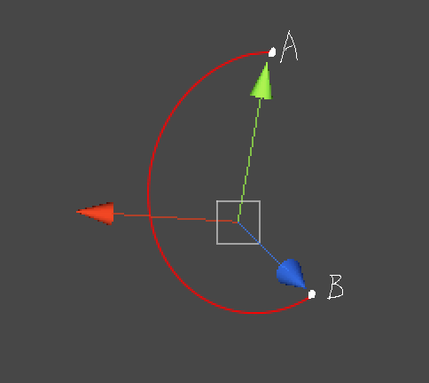

#万向节锁 Gimbal Lock

**2016-3-12**

最近遇到了一个问题，就是相机在转动到一定角度的时候就卡在了某一个角度无法继续旋转下去了，怎么都无法转动到想要的角度，有时候转动角度会有突变或者转动轨迹和预想的不一样。其实第一个想到的原因就是 Gimbal Lock。关于 Gimbal Lock，以前有了解过这方面的资料，不过项目中一直没有遇到过，所以没有特别的在意。主要当相机需要大角度转动时才有可能出现，如果你要做一个 360 度无死角转动的相机，那么必然会遇到。

如上图所示，原本从 A 点到 B 点，直接直线差值就可以了，但是却出现了运动轨迹是曲线的情况。

下面可以在 Unity 中做一个简单的实现：

    // 定义 eulerAngle
    eulerAngle = 0.0f;
    
    // 在 Update 中调整 eulerAngle 改变 Transform
    eulerAngle += 20 * Time.deltaTime;
    // 执行代码（1）
    transform.eulerAngles = new Vector3(90, eulerAngle, 0);
    // 执行代码（2）
    transform.eulerAngles = new Vector3(90, 0, eulerAngle);

当执行代码（1）或者代码（2）时，我们发现物体只是转动方向反了，而不是预想的绕着不同的轴转动。这就是 Gimbal Lock，原因就在于 90 这个值上。具体的是什么原因导致的呢，在这个[视频讲解](http://v.youku.com/v_show/id_XNzkyOTIyMTI=.html#paction)里将得很清楚了。对于这个问题可以使用 Quaternion 来解决。

    eulerAngle += 20 * Time.deltaTime;
    Quaternion q = Quaternion.AngleAxis(90, Vector3.right);
    q *= Quaternion.AngleAxis(eulerY, Vector3.up);
    transform.rotation = q;

