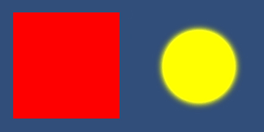
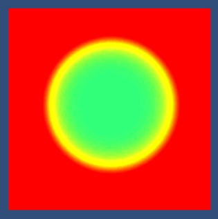

# 开启 HDR 时的 Blend 注意事项

**2018-2-7**

在开启 HDR 时需要注意 Blend 可能引起的问题。比如说 Unity 自带的材质 “Particles/Alpha Blended” 在 HDR 开启状态下就会出现画面显示异常。

	// Blend 状态设置
	Blend SrcAlpha OneMinusSrcAlpha

	// 颜色输出
	fixed4 col = 2.0f * i.color * tex2D(_MainTex, i.texcoord);
	return col;

这个代码在非 HDR 时不会什么问题，但是当切换到 HDR 时就会导致渲染画面出现问题。

在下面的例子中有两个面片，一个为红色的方形面片，一个为黄色的圆形面片，都使用 Unity 自带的 “Particles/Alpha Blended” 作为材质。当它们分别渲染时，效果似乎是正确的，注意这里也只是说似乎正确，稍后会解释为什么。（为了将注意力放在问题本身，暂时忽略 Gamma 矫正）

> 

将这两个面片一起渲染时问题就出现了。

> 

很明显上图中的效果是错误的，正确的效果是红色方形面片上叠加一个黄色圆形面片。而出现错误的原因正是由于开启了 HDR，并且材质中没有考虑到 HDR 导致的。下面就一步步来分析。

首先，先渲染红色方形面片，最终写到 Color Buffer 中的值应该是一个红色，但是有多红呢。由于开启了 HDR，RenderTexture 的单通道不再是 8bit，而是更多的 bit，这就意味着单通道的最大值是不再是非 HDR 情况下的 1，会比 1 大很多，具体最大值是多少需要看 RenderTexture 的格式是什么。明白了这点后再看代码：

	fixed4 col = 2.0f * i.color * tex2D(_MainTex, i.texcoord);

这里的 _MainTex 赋予的是白色贴图 fixed4(1,1,1,1)，i.color 是 fixed4(1,0,0,1) 的红色，因此 col 变量的值为 fixed4(2, 0, 0, 2)，所以最终写到 Color Buffer 中的红色，不是 1，而是 2。开始划重点了，再仔细想想到底是不是 2，这里也是我一开始忽略的地方，而问题的关键就在这。由于设置了 Blend 方式。

	Blend SrcAlpha OneMinusSrcAlpha

这种 Blend 方式对应的公式是：

	final color = SrcAlpha * SrcColor + (1 - SrcAlpha) * DestColor

根据上文中的例子：

	SrcAlpha = 2
	SrcColor = fixed3(2,0,0)
	DestColor = 背景色 <= fixed3(1,1,1)

将这些值代入 Blend 公式后会发现，最终写入 Color Buffer 是一个 R 通道介于 3 到 4 之间的红色。这也是上文中为什么说是看似正确，因为虽然输出的红色从效果上是正确的，可实际已经不在控制范围之内。而当我们将一个黄色的圆形面片叠加上之后，问题就完全暴露了。这里还有一个注意点，R 通道是介于 3 到 4 之间的值，那么 GB 两个通道呢，再次划重点，此时这两个通道中写入了两个负值，值的大小和背景色有关，这也是不可忽略的，会影响到后续的叠加色输出。

在那张错误的效果图中可以看到，原本的圆形黄色面片中间出现了出乎意料的偏绿色。颜色不可能凭空出现，一定是经过了某种操作，所以第一个想到这三个颜色之间的关系是 “绿色=黄色-红色”。顺着这种假设，再参照上文的分析，在渲染这个圆形黄色面片的时候（由于圆形是通过一张 Alpha 渐变的 Mask 贴图做出来的，为了将问题简化，先只考虑圆心处 Mask 的 Alpha 接近 1 的情况）：

	SrcAlpha = 2
	SrcColor = fixed4(2,2,0)
	// 上文中说明了 R 通道是一个介于 3 到 4 之间的一个值
	// GB 通道是两个负值，值的大小和背景色有关
	DestColor = fixed3(3.5,-g,-b) 

再次将这些值代入 Blend 公式，就会得到一个偏绿色的值了，这也就解释了为什么会出现上文图中的错误。同理，圆中间的绿色是错误的，而黄色的渐变的过度似乎是正确的，其实也是错误的，只是巧合下的看似正确。