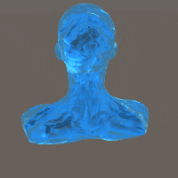

# 冰块渲染

**2016-11-6**

这次需要在场景中增加一个冰雕的模型，没有找到现成合适能用的，所以只能新写一个了，在制作效果之前首先要理清思路。

首先我参考了 [Real-Time Approximations to Subsurface Scattering][link1]，这篇 [GPU Gem][link2] 的文章介绍了一种近似次表面散射的方法，其中使用了 Wrap-Diffuse 来避免暗部过黑的问题，使用实时渲染的一张 Depth-Map 来判定物体的厚度，从而控制光的穿透程度。

我们要实现的效果和文章中介绍的有一定的相似，但又不是完全一样，最大的不同是文章中使用厚度来决定光线穿透物体的程度，而一块纯净的冰块并不是这样的，它的光学属性有点像玻璃，光折射进入内部再折射出去，在这过程中光有轻微的折射但是完全穿透，几乎不存在厚度越大衰减越大的效果。而冰块的边缘部分由于凹凸不平、密度也不像中心部分那么紧致，光会随机折射，最终表现为环境光和次表面散射的混合。冰表面的另一个现象是由于融化形成的水在光的照射下，如果角度合适会正好反射到眼中，看到一点一点的闪光。

根据以上这些的分析，思路就渐渐清晰了。

[link1]: http://http.developer.nvidia.com/GPUGems/gpugems_ch16.html

[link2]: http://developer.nvidia.com/object/gpu_gems_home.html

> 
>
> 根据上文中分析渲染出来的效果

从图中可以看出，最外层的一层蓝绿色为直接折射/反射的环境；中间层蓝色为近似的次表面散射（由于环境光照更多的是蓝色）；中间部分（头部、两肩）光大部分直接穿透冰块，可以清晰的看到冰块背面的物体；随机的闪烁点为融化的水造成的。

以上是总体的介绍，下面说说实现上的一些细节：

如果完全按照 [Real-Time Approximations to Subsurface Scattering][link1] 中的实现方式，光的穿透方式并不是我们想要的，所以在此基础上进行了改进。我们使用了一张 Thickness-Map 配合 NdotV 的方式来决定光的穿透程度。对这两个进行融合，最终得到光的穿透程度。

> 
>
> Thickness-Map。黑色表示穿透强，白色表示穿透弱，这是一张随机的 Perlin-Noise。

---

> 
>
> NdotV 就是法线和视线的点乘。白色表示穿透强，黑色表示穿透弱。

对于穿透度非常强的冰块，我们是可以看到冰块背面被挡住的物体的，但是需要注意材质并非是 Alpha-Blend 的，所以我们使用了 Cubmap，计算折射射线，对 Cubmap 采样，叠加的冰块上。

冰面的闪烁参考的是 [Winter Shader](https://www.assetstore.unity3d.com/en/#!/content/13927) 这个插件中的实现方式。改进之处在于，我将渲染步骤移动到了 PostEffect 部分，这样经过 PostEffect 的处理，就避免的闪烁点很明显的像素化问题。

以上就是所有用到的知识点，着色器代码就不贴在这里了，因为还很初级其中有很多 hack 的地方并不方便解释，是不断调整后的经验值。但是所有问题都已经在上文中说清楚了。最后说明下，上文中描述的冰块的这种光学特性只是为了渲染而假设出来的，并不符合物理特性，如果想要了解正确的物理属性应该查看专业的文献。

