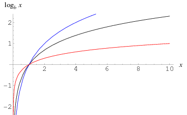

# Shader 中的对数指令

**2018-7-3**

Shader 中使用 pow(x,y) 指令的时候需要注意，当 x<=0 时，结果可能是未定义的。其原因是，pow 指令的一种内部实现是这样的：

	pow(x,y) => exp(y * log(x))
	
从对数函数的图像可以看出：

> 
> 
> 图片来源  [http://mathworld.wolfram.com/Logarithm.html](http://mathworld.wolfram.com/Logarithm.html "http://mathworld.wolfram.com")

图像是 x>1 的情况，当 0<x<1 时图像沿 x 轴垂直翻转。 所以很明显，x<=0 时未定义。

pow 在最常见的 BlinnPhong 中并不存在这个问题：

	float nh = max (0, dot (s.Normal, h));
	float spec = pow (nh, s.Specular*128.0) * s.Gloss;

因为 x<=0 时为背面剔除的部分，所以可以忽略 x<=0