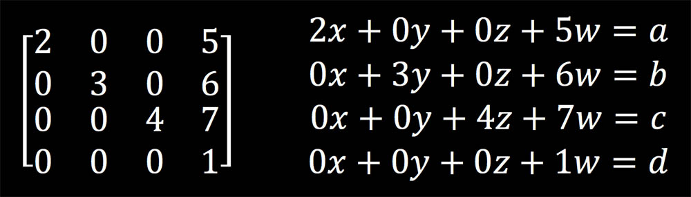
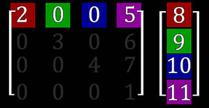
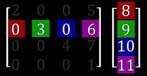
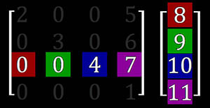
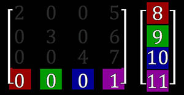
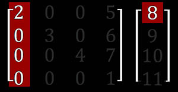
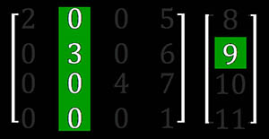
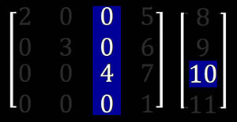
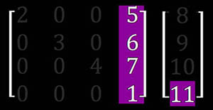

#矩阵基础

**2016-4-14**

游戏开发中，经常会使用到矩阵，这里总结一些基础知识。下文中所有列出的矩阵都是 OpenGL 的矩阵形式。暂且先记录几点，以后不断补充。

###Case1

什么是矩阵？想清楚这个问题是很关键的，这会关系到你如何看待矩阵。如果我们理解的并不它原本想表达的意思，那怎么可能有正确的结果呢。所以先把这个基本的问题理解下。在很多的教科书上，讲解矩阵都会从解方程组开始，那么我要说矩阵就是一个方程组。当你把 xyzw 分量作为未知数传入方程组后，方程组会计算出对应的四个分量 abcd。

原始的 xyzw 和新的 abcd 之间存在这一种联系，这个联系就是上面的方程组，换种说法就是矩阵。从图形编程的角度来看，这就是矩阵变换。很多时候我们需要求一个变换矩阵的时候，都是先列出方程组，把方程组规整为上图中的形式，然后就能直接写出矩阵的表达方式了。网上很多关于投影矩阵、镜面矩阵的推导无一例外都是使用的这个方式。

###Case2

矩阵乘法怎么计算？实际情况中，我们不太会关心到矩阵的乘法计算细节，因为 API 已经封装好了，直接调用即可。对于一般的情况都是可以满足的，然而有些技术需要我们更深入的了解矩阵，这时候就必须知道矩阵乘法的细节了。还是用 Case1 中的矩阵为例，学习下矩阵的两种计算乘法的方式，这两种方式从不同的思考问题的角度出发，形式虽然不同，但是结果是相同的。这里我们说的是矩阵和向量相乘，至于两个矩阵相乘其实是一样。

如图所示，现在要计算矩阵和向量的乘法。首先使用点乘的方法，这种方法比较直观，只要知道了两个向量如何做乘法，就能把方法套用到矩阵上。首先我们忽略矩阵的二三四行，这样就变成了两个向量的点乘了，点乘的结果是一个标量。然后忽略矩阵的一三四行，同样计算两个向量的点乘，得到标量结果。以此类推，最终得到四个标量值，把这四个标量值组成一个向量就是我们要计算的结果了。

步骤1：

步骤2：

步骤3：

步骤4：

以上介绍的点乘的方法，非常容易理解。下面再介绍另一种方法，这种方法其实是从点乘方法中总结出来的规律，有时候考虑问题用这种方法会更好理解。向量的第一个分量和矩阵的第一列相乘，得到一个新的向量。向量的第二个分量和矩阵的第二列相乘，得到一个新的向量。以此类推得到四个新的向量，最后把这四个向量相加，即为我们要结算的结果了。

步骤1：

步骤2：

步骤3：

步骤4：

总之，这两种计算方式各有优势，在不同的情况下使用对于理解问题会有所帮助。以上说的是矩阵和向量的乘法，由于我们是以 OpenGL 环境来举例，所以是列向量左乘矩阵，而不是行向量右乘矩阵，这一点是需要注意的。如果已经理解了矩阵和向量的乘法，那么再看下两个矩阵的乘法就会非常简单了。可以把第二个矩阵分成四个列向量（或者不考虑的部分用0代替）分别与第一个矩阵相乘，最后再把结果组合起来形成一个新的矩阵。

学习矩阵的要点就是，千万不要把矩阵中的某一个值单独拿出来看，而是要以行、列、块为单位进行分析，这样才能更好的理解矩阵。

###Case3

为什么会有切线空间？在使用法线贴图的时候经常会遇到这个问题，我把这个问题打这样个比方。如果从月球上能看到地球上的人，那么地球看上去就像一个长满了刺的球一样，刺向四周发散出去，但是对于地球人来说，上方永远都是天空，所有人都觉得每个人的上方是同一个方向。这就是切线空间，站在月球上看地球就是模型空间。有了切线空间我们就能统一处理法线的方向了，否则法线方向各不相同，很难处理好。
