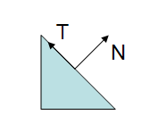
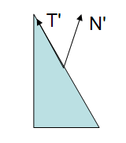

#Normal Transformation

**2016-3-26**

将模型空间的法线变换到其它坐标系，一般的做法是这样的：

    viewNormal = mul(UNITY_MATRIX_MV, objectNormal)
    
这种方法在一般情况下是正确的，但是当模型存在非均匀缩放（non-uniform scale）时，这样就会出现问题。

如上图所示，法线是垂直于表面的。如果我们直接将用来变换顶点坐标的矩阵来变换法线就会出现下面的情况。

可以法线变换后的法线不再垂直于表面了，如果使用这条法线再进行接下来的计算，很显然最后的结果就会出现问题。那么该如何变换法线才能避免这种情况呢。

    viewNormal = mul(UNITY_MATRIX_IT_MV, objectNormal)
    
这行代码和上面的差别就是 `UNITY_MATRIX_IT_MV`。UNITY_MATRIX_IT_MV 表示的是物体视矩阵的逆转置，至于为什么是 UNITY_MATRIX_IT_MV，可以参考下[这里](http://www.lighthouse3d.com/tutorials/glsl-12-tutorial/the-normal-matrix/)
，其中有详细的推导步骤，讲得也比较清晰。

至此，也解开了我长久以来的一个疑问，那就是：

    worldNormal = mul(objectNormal, _World2Object);
    
这里的代码非常奇怪，是不是乘法的顺序反了，如果你理解向量左乘矩阵和向量右乘矩阵的区别，一定会有这样的疑问，下面我们就来分析一下。首先回顾一下上面的结论，如果需要正确的变换法线，不能直接用变换顶点的矩阵，而是需要这个矩阵的逆转置。然后再看下上面的代码，本来应该使用 Object2World 的地方却使用了 World2Object，这两个矩阵正好互为逆矩阵。这样逆转置这两个条件就已经有了一个逆操作了，还缺一个转置操作。在 cg 中我们一般用的是列向量左乘矩阵，也就是 mul(M, v)。而这里是 mul(v, M)，把 v 当做一个行向量来处理，根据直觉这里肯定相当于进行了一步转置操作，于是拿笔手工算了下，果然把原本的列向量考虑为行向量右乘矩阵，就等同于左乘一个转置矩阵。

到此，也就解答了我一直以来的一个疑问，期间查阅了很多资料。感谢其他所有博主以及Google。最后吐槽下，Google真的很好用，Baidu就是个渣渣。