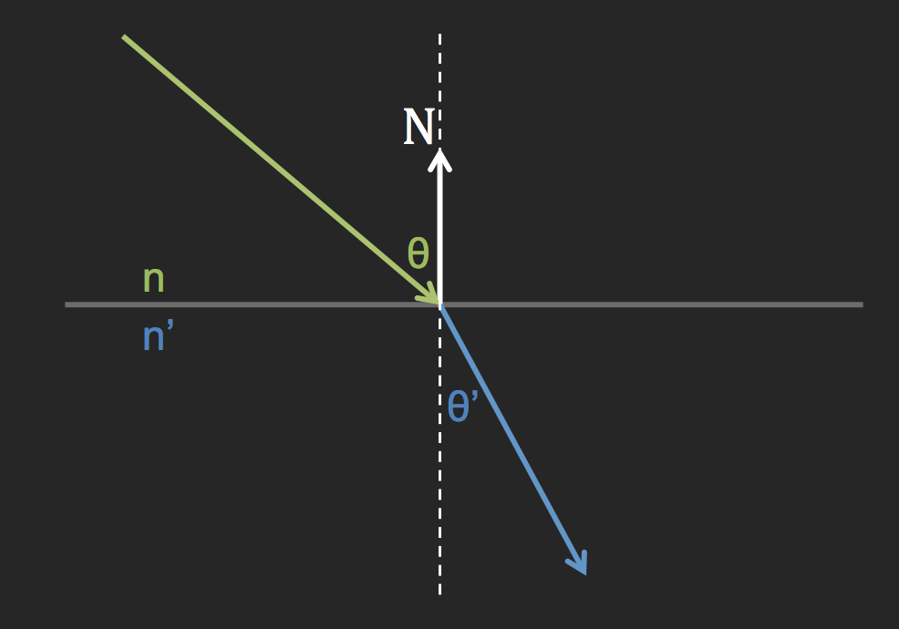

# 反射 折射

**2017-11-24**

### 反射

> 

	public static Vector3 Reflect(Vector3 v, Vector3 n)
    {
    	Vector3 b = Vector3.Dot(v, n) * n;
        Vector3 r = v - 2 * b;
        return r;
    }

计算反射射线的代码配合上图很容易看出来。

### 折射

> 
    
Snell 定律

\\[
n \ sin\theta = n' \ sin\theta'
\\]

折射中有一种称为全反射的现象，这种现象只有当光从光密介质到光疏介质时才会发生，也就是当 $ \theta'$ 大于 90 度时，折射光会消失，变成相对于法线的反射光。

    public static bool Refract(Vector3 v, Vector3 n, float ni_over_nt, out Vector3 refracted)
    {
        Vector3 uv = v.normalized;
        float dt = Vector3.Dot(uv, n);
        float discriminant = 1.0f - ni_over_nt * ni_over_nt * (1 - dt * dt);
        if(discriminant > 0)
        {
            refracted = ni_over_nt * (uv - n * dt) - n * Mathf.Sqrt(discriminant);
            return true;
        }
        else
        {
            refracted = Vector3.zero;
            return false;
        }
    }
    
计算折射射线的代码可以这样来理解：首先判断是否会出现全反射，根据上文中的描述 $ \theta' $
大于 90 度就表示出现了全反射，换一种说法就是 $ cos\theta'$ 小于 0。下面就可以从 Snell 定律来计算出 $ cos\theta' $ 的值。

\\[
\left\{
\begin{align}
& n \ sin\theta = n' \ sin\theta' \tag{EQ1} \\
& sin^2\theta' + cos^2\theta' = 1 \tag{EQ2}
\end{align}
\right.
\\]

\\[
\left\{
\begin{align}
& \because EQ1 \\
n^2 \ sin^2\theta &= n'^2 \ sin^2\theta' \\
sin^2\theta' &= sin^2\theta \ \left( n \over n' \right)^2 \tag{EQ3}
\end{align} 
\right.
\\]

\\[
\left\{
\begin{align} 
& \because EQ2 \\
cos^2\theta' &= 1 - sin^2\theta' \tag{EQ4} 
\end{align} 
\right.
\\]

\\[
\left\{ 
\begin{align}
EQ3 & \rightarrow EQ4 \\
cos^2\theta' &= 1 - sin^2\theta \ \left( n \over n' \right)^2 \\ 
cos^2\theta' &= 1 - \left( 1 - cos^2\theta \right) \ \left( n \over n' \right)^2 \tag{EQ5}
\end{align} 
\right.
\\]

至此，也就得到了 $ cos\theta $ 的值，代码中 discriminant 值的计算方式也由 $ EQ5 $ 得到了验证。

最后当判断完不会出现全反射时，便可计算折射向量了。

> 

	refracted = ni_over_nt * (uv - n * dt) - n * Mathf.Sqrt(discriminant); 
	
将红色向量减去橘黄色向量便得到了折射射线的方向。