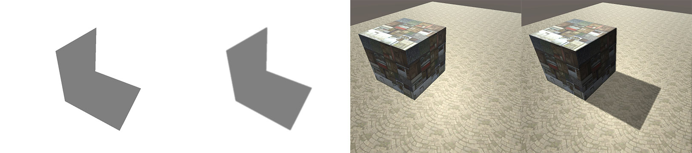
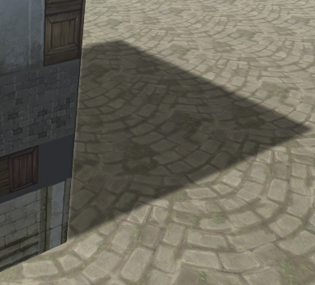
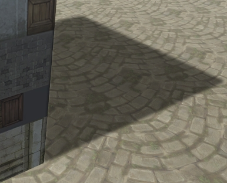
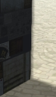
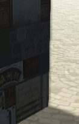

# Shadow Volume 3

**2017-12-28**

### Shadow Volume 阴影边缘的软化方法

虽然是使用 Shadow Volume 来达到硬阴影边缘的效果，但是如果阴影边缘太硬也会显得不自然，所以需要对阴影边缘进行一定的软化。这里使用一种简单的方法来做 Shadow Volume 的软阴影，首先使用常规的方法渲染 Shadow Volume 到 RenderTexture，然后对 RenderTexture 进行高斯模糊，最后将 RenderTexture 叠加到屏幕上，如下图：

> 

经过高斯模糊之后，会发现有部分阴影会出现异常：

> 

所以这里在高斯模糊之前会对 RenderTexture 上标记的 Shadow Volume 进行一次扩大，这样就能很好的缓解这个问题：

> 

但是需要注意，扩大多少并不能太随意，因为当扩大范围太大是又会出现另一个问题：

> 
>
> 图中为了演示，我将扩大范围放大了

可以很明显的看到阴影就像光一样溢出了。这是由于扩大的太多，所以经过高斯模糊后就会出现这个问题。

> 
>
> 这张图中，是一个比较合理的扩大范围，仔细看也能看到阴影溢出的问题，但是个人感觉可以接受。