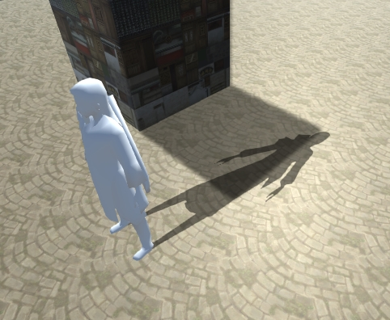
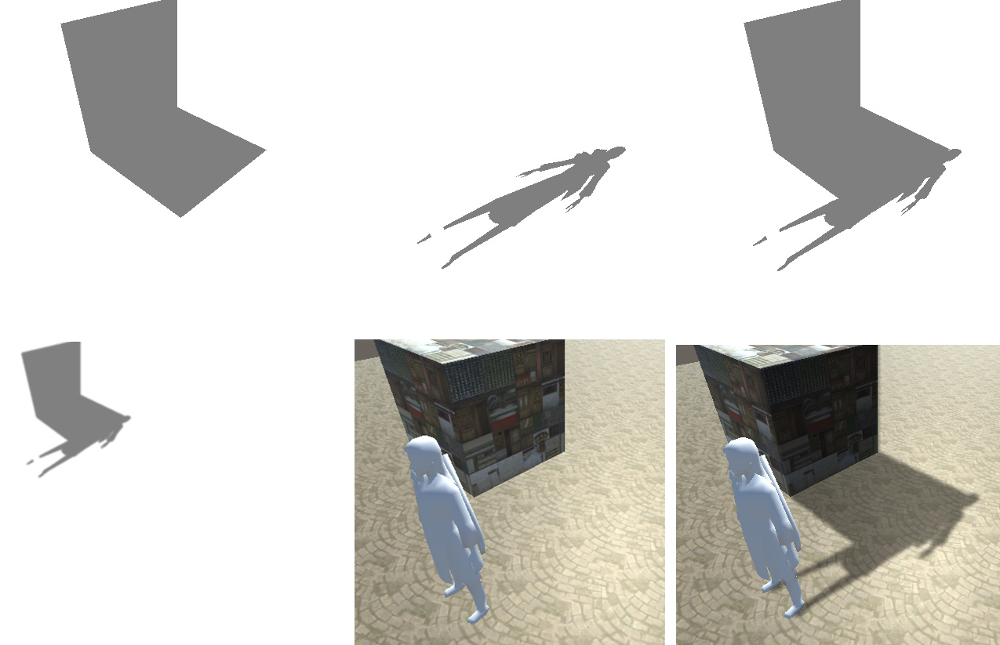

# Shadow Volume 4

**2017-12-28**

### Shadow Volume 和 Shadow Map 两种阴影融合

如果将 Shadow Volume 应用于动态物体会增加相当大的开销，比如说蒙皮骨骼动画，就需要实时计算 Shadow Volmue，不管是 CPU 还是 GPU，这么大的开销是不行的，对于移动端游戏更是如此。况且要生成 Shadow Volume，对模型本身也有一定的要求。所以对于动态物体还是打算使用 ShadowMap 的方式，这就需要解决的一个问题是，如何融合这两种类型的阴影。

> 

Cube 模型使用的是 Shadow Volume 渲染阴影，人物模型使用的是 ShadowMap 渲染阴影，两个阴影无法平滑过渡，显得非常生硬。还有，Shadow Volume 对其进行了边缘软化处理，而和 ShadowMap 的阴影边缘软化参数明显有很大差异，看着很不协调。所以这里的目标就是将两种阴影渲染方式进行融合，以达到尽可能好的效果。

经过一番思考，似乎可以从一处进行突破。Shadow Volume 的最后一步是在屏幕空间进行的，而 ShadowMap 其实也可以实现为屏幕空间阴影，这样我就可以在屏幕空间将两者进行统一，最后继续后续的步骤就可以了。

> 

如上图所示，先分别在屏幕空间渲染 Shadow Volume 和 ShadowMap 阴影，然后将两个阴影在屏幕空间合成（第一行），接着就是高斯模糊后叠加到屏幕上（第二行）。

> 
>
> 最后融合效果
