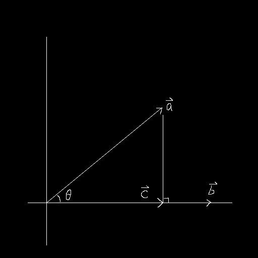
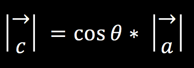
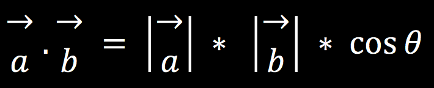
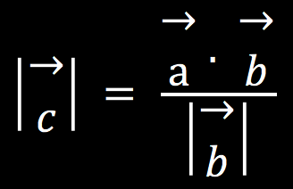

# 向量投影

**2016-4-1**

计算向量a在向量b上的投影（向量c）。

首先从三角函数公式出发

又因为向量点乘公式

所以得到

这一步求得的是向量c的长度。当向量b为单位向量的时候，长度为1，所以分母可以直接去掉。最后将求得的向量c的长度乘以单位向量b，得到的结果就是向量c。在Unity中代码表示为：

    Vector3 c = Vector3.Dot(a, bNormalize) * bNormalize;