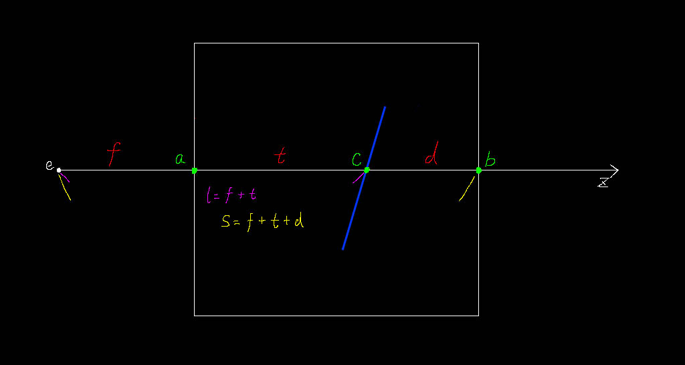
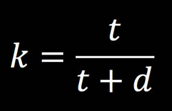

#体积雾

**2016-4-12**

基于顶点的雾效，由于计算的雾色最终是叠加到模型上渲染出来，无法表达出体积感。所以需要一种新的可以表达体积的雾效，我们把它称之为体积雾。这篇文章主要是介绍下体积雾的一种实现原理，其中的方法和思路都是来自网上各种资料，结合我自己的理解整理而来。先看一下效果图。

从图上可以看出，由于两座山体之间没有任何物体，普通的顶点雾只能附着于模型上，也就是说只能在山体上产生雾效，无法产生上图中的效果。对于普通的渲染来说，既然要在原本没有物体的两座山峰之间渲染出东西（雾效），那在这些空白的区域中一定是有物体存在的，只是不是把这些物体当做普通的模型来渲染，而是以某种叠加的方式进行处理，根据雾的浓度来叠加到山体上。下面就来说说体积雾的实现原理。

这是一张示意图，用来把我们要处理的问题进行简化，把复杂的模型用线条来表示，把三维空间用平面切面代替。蓝色的斜线表示在体积雾中的一个物体（效果图中的山峰）。点e表示眼睛所在的位置，也就是主摄像机的位置。外层的矩形表示体积雾的范围，既然的体积雾那就必须是有体积的，所以在这个例子中，体积是一个矩形（三维空间中的立方体的一个切面）。从点e会发出无数条射线，穿过体积雾，这里我只画出了其中一条。点c是射线和物体的交点。点a和点b表示射线和体积雾的两个交点。t表示线段ac的长度，d表示线段bc的长度，f表示线段ae的长度。至此我们已经把模型简化成了上图的样子，下面就是在此基础上进行分析。需要申明的是，为了不把问题复杂化，我们先只考虑最简单的情况，也就是上图所示的物体完全在体积雾中。等把这种情况理解后再去思考其他情况就会容易许多。

当你看雾中的某个物体，这个物体的清晰度取决于这个物体离你有多远。离得越远看得越模糊，越近就越清晰。根据这个思路，在上面的示意图中也可以找到这么一个对应的参数。这个参数就是t。当t为0的时候，点a和点c是重叠的，这是点c看得最清楚的时候。当t和d相等的时候，这时点c在矩形的中间，看点c就不那么清楚了。当d为0的时候，点c和点b是重叠的，这时应该完全看不到点c了（完全被雾挡住）。总结为一个公式。

k表示雾的浓度。其实这就是体积雾的全部思路的，非常简单，下面就是要找到能够表达出这整个过程的数学方法和程序方法。体积雾是要在 Shader 中实现，并且是要在 fragment 中实现。

点e，相机的位置，这个好办，Unity 已经为我们定义好了这个值 `_WorldSpaceCameraPos`，也可以自己处理把相机的世界空间坐标通过 uniform 值传递给 shader。

点a和点b，其实是在求射线和矩形的交点，这里介绍一种简单快速的可以在gpu中实现的方法，来自网上的资料。具体详见[raytracing](http://www.cs.cornell.edu/courses/CS4620/2013fa/lectures/03raytracing1.pdf)、[gpurt](http://www.clockworkcoders.com/oglsl/rt/gpurt1.htm)和我以前的一篇学习笔记[RaySlabIntersection](RaySlabIntersection.html)。至此，我们就能求得f和s。

最后只要再求得点c，就能得到t和d的长度了。这里要用到的是 Depth Buffer。Unity 内置了获取 Depth Buffer 的方法。

	// 在 CSharp 脚本中开启
	Camera.main.depthTextureMode |= DepthTextureMode.Depth;
	// 在 Shader 中获取
	sampler2D _CameraDepthTexture;
	depth = tex2Dproj(_CameraDepthTexture, uv);
	
这里的uv坐标获取有一点技巧，需要将顶点坐标映射到屏幕坐标，细节可以看下[ComputeScreenPos](ComputeScreenPos.html)和[ProjectiveTexturing](ProjectiveTexturing.html)。获取的depth还不能直接拿来使用，需要考虑到是否将深度值编码到了rgb中，如果是那需要解码，如果没有，就直接从单通道中获取并且将非线性的01空间映射到线性的视空间。当然 Unity 为我们封装了这些工具函数，你不想关心这些细节也没关系，直接调用即可。如果计算正确的话就可以得到线段l的长度。

至此，示意图中的所有参数都已经齐全了，就是说上面的示意图所示的体积雾已经可以实现了。然后就要处理其他的情况，比如说物体不再体积雾中的情况。如果上面所有的步骤都能很好理解的话，这应该不是难事。通过观察我们完全可以找出任何情况下，f、t、d这三个参数之间的一些关系，先在 shader 中用 if 条件判断实现功能，然后再考去掉条件判断即可，这里就不展开细节了。

根据上文中的那个公式算出来的体积雾，是一个线性衰减的过程，如果需要非线性的衰减，可以通过一些数学技巧来达到目的。

最后说一下 Depth Buffer 的事情。上文中说到的是我们使用 Unity 提供的接口来获取 Depth Buffer，其实完全可以自己来渲染 Depth Buffer，详见[CustomDepthTexture](CustomDepthTexture.html)。这样做是有一定的好处的，比如说有很多小物件我们并不需要渲染到 Depth Buffer 中，因为这种细小的深度值变化根本不会影响到最终的效果，这样在渲染深度纹理时就能节省下一部分资源。

