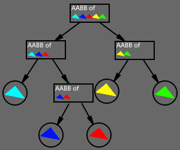

# UE4 的 kDopTree

**2017-6-15**

[UE4][link1] 中的 kDopTree 是使用二叉树对空间中的三角形进行划分，并使用 [Ray-Slab Intersection][link2] 进行线段和包围盒碰撞检测，最终对线段和包围盒中的三角形进行相交检测。其目的是为了加快离线生成 [SDF][link3] 的速度。下面会对这个算法的细节进行说明和总结。

以下分析是基于 [UE4 的 14.15版本][link4]。 

### 构建 kDopTree

在三维空间中使用一维的方式进行构建，也就是说只考虑其中的一根轴（x轴 或 y轴 或 z轴），那么挑选哪根轴呢？首先计算所有三角形的几何中心的平均数，得到的值就可以近似认为是模型的几何中心，然后计算所有三角形偏离几何中心的方差，方差越大说明三角形更越偏离几何中心。因为几何中心是个三维值，所以方差也是三维的，分别对应 x轴、y轴、z轴，挑选最大方差对应的轴来进行二叉树的构建。

为什么选择最大的方差呢？其实无论选择哪个都不会影响到最终结果的正确性，我觉得这么做是为了后面加快碰撞检测的速度。因为方差越大，三角形越偏离几何中心，也就是说所有的三角形位置在整体上来看就越平坦，碰撞检测时就可以减少线段和多个 AABB 以及多个三角形同时发生相交的概率。

挑选构建轴之后就要开始构建 kDopTree 了。先将所有三角形坐标按照构建轴进行大致排序，偏大的值放到靠近数组右边，偏小的值靠近数组的左边，然后对数组左边部分和右边部分重复这个操作，这其实就像二分排序一样。每一次二分排序都会形成一个二叉树节点，节点需要记录一个 AABB 包围盒，AABB 的大小是所有当前排序三角形的包围盒（二叉树当前节点的子节点下所有三角形的三维范围）。最后，当需要排序的三角形数量少到一定值时（UE4 中是4个三角形），就认为不需要再继续排序了，这时就可以生成叶子节点，叶子节点需要记录包含了哪些三角形和一个 AABB 包围盒。

至此 kDopTree 构建完成。

> 
> 
> kDopTree 简图

### 碰撞检测

使用 kDopTree 对线段和三角形进行碰撞检测。

在 kDopTree 中已经构建好了包围盒层级关系，检测线段和父级 AABB 是否相交，如果相交再继续迭代子 AABB 直到找到叶节点，最后使用叶子节点上记录的三角形和线段进行碰撞检测。

关于线段和 AABB 的碰撞检测可以参考 [Slab-based-Intersection][link5]。

最后是线段和三角形的碰撞检测。先判断线段是否和三角形所在平面相交，根据平面方程 `Ax + By + Cz + D = 0` 判断线段两点是否在平面同侧（排除掉这个情况），求出线段和平面的交点，并判断交点是否在三角形内。上文中说了，kDopTree 的叶节点上有四个三角形，所以需要对四个三角形进行同样的检测，挑选一个和线段距离最近的交点。

至此完成碰撞检测。

### 进一步加速计算

在 UE4 中，使用了 [SIMD][link6] 进一步加快了计算速度，简单来说，就是可以将一条线段同时和四个 AABB 进行相交检测，可以同时和四个三角形进行相交检测，这也是为什么 kDopTree 的叶节点选择四个三角形的原因。

[link1]: https://github.com/EpicGames/UnrealEngine
[link2]: http://www.cs.cornell.edu/courses/cs4620/2013fa/lectures/03raytracing1.pdf
[link3]: https://docs.unrealengine.com/latest/INT/Engine/Rendering/LightingAndShadows/DistanceFieldAmbientOcclusion/index.html#howdoesitwork?
[link4]: https://github.com/EpicGames/UnrealEngine/releases/tag/4.15.3-release
[link5]: Slab-based-Intersection.html
[link6]: https://en.wikipedia.org/wiki/SIMD