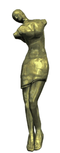

# 光照烘焙到纹理

**2016-7-?**

移动设备上的硬件资源是十分有限的，所以在表现出好的效果的同时还要考虑到执行效率。法线贴图可以在面数较低的模型上表现出凹凸的效果，但是随之而来的是计算量的增加，因为所有的计算都要在切线空间中进行，特别是当法线贴图参与到大面积的屏幕像素计算时，消耗更是不可忽视。所以我们就考虑是否可以将法线贴图参与光照计算时所产生的明暗信息记录到漫反射贴图上。于是就有了著名的 ShadowGun 的 RenderToTexelBaker 工具。

> 
>
> 法线和光照信息都被烘焙到了漫反射贴图中。随之而来的好处是 Shader 中完全不用在切线空间中进行任何光照计算，直接采样漫反射纹理即可。而坏处由于已经将信息烘焙到了贴图上，所以这一类的物体只能是静态的，无法对 transform 做操作，高光与视角无关。

[Dota2-Character-Texture-Guide](https://support.steampowered.com/kb/8700-SJKN-4322/dota-2-character-texture-guide)，这篇文章中介绍了 Dota2 中是如何将光照信息烘焙到漫反射贴图上的，可以看到有很不错的效果。

> 
>
> 只用了一张漫反射贴图就表现出了凹凸和光影关系。

上面介绍了实际游戏中的两个应用。Dota2 的那个文章中并没有介绍具体的方法，而 ShadowGun 的 RenderToTexelBaker 工具是有完整的源代码的。从源代码中可以看到 ShadowGun 的方法还是比较复杂的。主要思路就是找到纹理每一个像素对应的顶点位置（法线切线）（世界空间）（这需要在 CPU 上手工进行顶点插值），存储在纹理中，再在 Shader 中计算光照，输出到 RenderTexture 中，最后保存为一般的纹理以供使用。

我这里提供一个更简单的方法，不需要再 CPU 中进行手工的顶点插值，同样是在 Shader 中进行光照计算，也是输出到 RenderTexture 中：

	#ifdef SCREEN_SPACE_LIGHTING_BAKING
		#if ((defined(SHADER_API_GLES) || defined(SHADER_API_GLES3)) && defined(SHADER_API_MOBILE)) || defined(SHADER_API_OPENGL)
			o.vertex.xy = v.uv * 2 - 1;
		#else
			o.vertex.xy = v.uv * float2(2, -2) + float2(-1, 1);
		#endif
		o.vertex.z = 0;
		o.vertex.w = 1; 
	#else
		o.vertex = mul(UNITY_MATRIX_MVP, v.vertex);
	#endif

从上面的代码可以看出，正常是使用 MVP 矩阵来变换顶点坐标，但是这里直接使用顶点的 uv 作为变换后的顶点坐标输出。

不管是我这里提供的方法还是 ShadowGun 的方法，都存在这一个缺陷，就是当模型的 uv 有重叠时会出现问题。比如为了节省贴图和美观，3D 美术师在制作模型和展 uv 时会使用到对称的模型，所以中线两面的模型的 uv 是重叠的，这种情况就不能简单的像上面一样处理了。